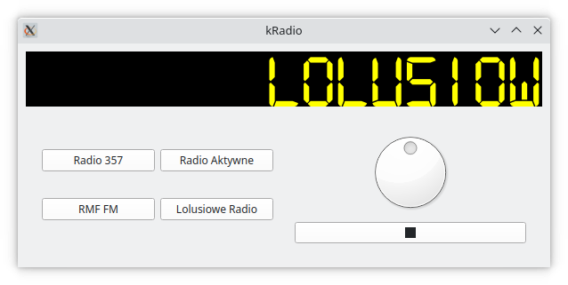

# kRadio
A simple desktop application written in Python using PySide2 Qt bindings for listening to internet radio.

## How to use
To run the application, go to the root folder and run: 
``python main.py``

The presets are programmable. Currently, they are able to be configured through the *config.json* file, under the "presets" key. Simply change or add a new entry in the list with the following format: 
``{"name": "/name of the radio station/", "url": "/url to the stream/"}``

## Credits
Digital-7 Mono font was created by [Alexander Sizenko (Style-7)](http://www.styleseven.com/).